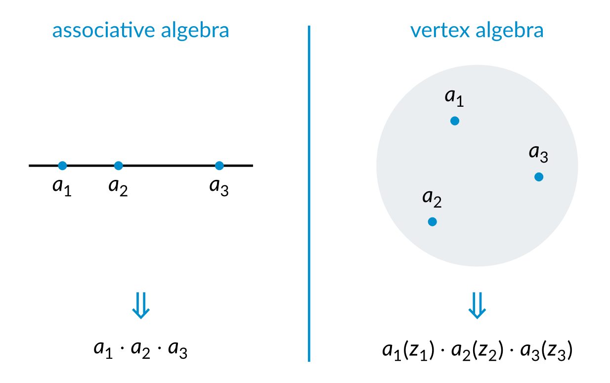

Vertex algebras are a somewhat mysterious type of algebraic structure.
Their foundational ideas come from conformal field theory in physics,
while they also have seen deep connections to various areas of mathematics.

When I first started learning about vertex algebras for my undergraduate thesis,
I found them quite baffling.
Their definition was technical,
and the standard references I looked at, such as
\[[Frenkel, Ben-Zvi 2004](#references)\] or
\[[Kac 1998](#references)\] (titled 'for beginners'!),
did not help much in the intuition aspect.

Now, having worked with these weird objects for some time,
I have managed to understand them better.
Still, I am very surprised that the simple intuitive ideas behind them,
which are well-known to experts,
are not easily accessible ---
in fact, I doubt that they exist in the literature
(or anywhere) at all, in an explicit form.

Therefore, I decided to write this note to explain these ideas.
I hope this will be helpful to others
who are also learning the subject
and feeling confused as I was years ago.



## Idea

In a nutshell, a vertex algebra is a _two-dimensional_ algebraic structure.

We think of a usual associative algebra as a _one-dimensional_ structure,
as living on a line $\mathbb{R}$, in the sense that
given several points on the line,
if we assign an element of the algebra to each point,
we can multiply them in the order given by the line.
The product does not change when we move the points around,
as long as they do not cross over each other.
This is illustrated on the left in the picture below.





On the other hand, in a vertex algebra,
we multiply elements on the complex plane.
This means that given several points $z_1, \dotsc, z_n \in \mathbb{C}$,
if we assign an element $a_i$ to each point $z_i$,
we get a product $a_1 (z_1) \cdots a_n (z_n)$.

The main feature that characterizes vertex algebras is that
the product $a_1 (z_1) \cdots a_n (z_n)$
depends _meromorphically_ on the variables $z_i$.
Moreover, the product can only have poles when $z_i = z_j$ for some $i \neq j$,
that is, when two of the points collide.


If you have heard of the **little discs operads**
$\mathbb{E}_n$
([*n*Lab](https://ncatlab.org/nlab/show/little+cubes+operad)),
you might sense the similarity between
vertex algebras and $\mathbb{E}_2$-algebras.
The main difference lies in the meromorphicity mentioned above.
For $\mathbb{E}_2$-algebras,
the product depends continuously on the configuration of the points,
and when, for example, one point goes around another,
this detects the higher homotopical structure in the algebra.
While vertex algebras do not care about homotopy
(vector spaces are contractible),
it allows us to, for example,
take derivatives or residues and obtain extra information,
because of the meromorphicity.

This relation is more precisely captured in the theory of
**factorization algebras**
([*n*Lab](https://ncatlab.org/nlab/show/factorization+algebra)),
which are, in some sense,
a simultaneous generalization of both kinds of algebras.

See also [this MathOverflow question](https://mathoverflow.net/a/54008/484230)
for a related discussion.


## The new definition

Here is a new definition of a vertex algebra,
which is, in my opinion, more enlightening than the standard one,
which I will discuss later.


A **vertex algebra** is:

- A vector space $V$,

- equipped with a unit element $1 \in V$,

- and a family of multiplication operations

  $$
    \begin{aligned}
      V^{\otimes n} & \longrightarrow V [[z_1, \dotsc, z_n]] \\, [(z_i - z_j)^{-1}] \ ,
      \\\\[.5em]
      a_1 \otimes \cdots \otimes a_n & \longmapsto a_1 (z_1) \cdots a_n (z_n) \ ,
    \end{aligned}
  $$

  where the $0$-ary multiplication gives the unit element $1$,

satisfying the following properties:

- **Commutativity:** The product $a_1 (z_1) \cdots a_n (z_n)$
  does not depend on the order of the factors.
  For example, $a (z) \cdot b (w) = b (w) \cdot a (z)$.

- **Associativity:** This includes a series of axioms that look like

  $$
    \begin{aligned}
      & \bigl[ a_1 (z_1) \cdot a_2 (z_2) \bigr] (z) \cdot
      \bigl[ b_1 (w_1) \cdot b_2 (w_2) \bigr] (w)
      \\\\[.5em]
      & \qquad =
      a_1 (z_1 + z) \cdot a_2 (z_2 + z) \cdot
      b_1 (w_1 + w) \cdot b_2 (w_2 + w) \ ,
    \end{aligned}
  $$

  where we expand the power series on the right-hand side
  in the limit $|z_i|, |w_i| \ll |z|, |w|$.
  This is for two groups of two,
  and there are similar axioms for any number of groups of any,
  possibly different, size.
  The variables always follow the rule that
  whenever two of them are combined, they are added together.



The associativity axiom might look complicated, but it is actually just the
usual associativity of multiplication,
with a bunch of $z$ and $w$ variables thrown in.

This more straightforward definition was hinted at in
\[[Borcherds 1998](#references)\],
but not fully spelled out.
A more rigorous treatment was done by
\[[Kim 2011](#references)\],
who, strangely, did not state his result in terms of vertex algebras.
I only learned about this from an unpublished paper by Dominic Joyce,
and as of this writing, I am not aware of any published reference
on this precise version of the definition.


From a technical point of view,
one might argue that this is actually a more complicated definition
than the traditional one,
because there are infinitely many associativity axioms.
However, this is not the point of this note,
as I only aim to make the definition more intuitive,
and this is achieved by making the definition look
more like the usual definition of an algebra.

One might also expect that such a formulation
should mean that vertex algebras are commutative algebra objects
in a certain category.
This is indeed almost true, except that the category
does not have all compositions defined.
This was explained in \[[Borcherds 1998](#references): Example 6.6\].


## Fields and translation

If we look at the above definition more carefully,
some useful information can be extracted.
Here, I will focus on explaining the facts,
while leaving out some details.

First, since the $1$-ary multiplication is defined,
it means that every element $a \in V$ automatically comes with
a power series $a (z) \in V [[z]]$,
which some people would call the **field** associated to $a$ (while others wouldn't!).
The value at $z = 0$ is the element itself, $a (0) = a$.

It then makes sense to differentiate the field $a (z)$ with respect to $z$,
which defines an element $\partial_z a (z) \in V [[z]]$.
We denote this differential at $z = 0$ by

$$
  T a = \partial_z a (z) \\, \bigr|_{z = 0} \in V \ .
$$

We also have that $(T a) (z) = \partial_z a (z)$,
which justifies that it is reasonable to also call $\partial_z a (z)$ a field.
We can also take higher derivatives of $a (z)$ similarly.

This operator $T \colon V \to V$ is
called the **translation operator**,
which I find a bit misleading,
and would rather call it something like the derivative operator.
In fact, the actual translation operator is the operator

$$
  \exp (z T) = \sum_{n = 0}^\infty \frac{z^n}{n!} T^n
  \colon V \longrightarrow V [[z]] \ .
$$

Let me elaborate on this. There is the identity
$\exp (z \partial_z) \\, a (w) = a (z + w)$,
which is a formal fact and
does not involve anything about vertex algebras.
This implies that

$$
  \exp (z T) \\, a (w) = a (z + w) \ ,
$$

which is the true reason for the name.
In particular, taking $w = 0$ gives

$$
  a (z) = \exp (z T) \\, a \ ,
$$

which can be seen as an alternative definition of the field $a (z)$,
and will be useful in understanding the old definition of vertex algebras later.

## The old definition

Let us now see how the standard definition of a vertex algebra
fits into this new picture.
The standard definitions differ slightly between different sources,
but they all look something like the following, taken from
\[[Frenkel, Ben-Zvi 2004](#references)\].


A **vertex algebra** is:

- A vector space $V$,

- equipped with a unit element $1 \in V$,

- and an operator $T \colon V \to V$, called the translation operator,

- and a product operation
  $$
    \begin{aligned}
      V \otimes V
      & \longrightarrow
      V [[z]] [z^{-1}] \ ,
      \\\\[.5em]
      a \otimes b
      & \longmapsto
      Y (a, z) \\, b \ ,
    \end{aligned}
  $$

satisfying the following properties:

- **Unitality:** $Y (1, z) = \operatorname{id}_V$,
  and $Y (a, z) \\, 1 \in a + z V [[z]]$.

- **Translation:** We have the commutator
  $[T, Y (a, z)] = \partial_z Y (a, z)$, and $T (1) = 0$.

- **Locality:** For any $a, b \in V$, there exists $n > 0$ such that
  $(z - w)^n \cdot [Y (a, z), Y (b, w)] = 0$.



To get this from the new picture,
the translation operator $T$ is as in the previous section,
and the product is defined as

$$
  Y (a, z) \\, b = a (z) \cdot b (0) \ .
$$

The element $Y (a, z) \\, 1 \in V [[z]]$
is what we called $a (z)$ before,
and more generally, the product
$a_1 (z_1) \cdots a_n (z_n)$ in the previous language
corresponds to
$Y (a_1, z_1) \cdots Y (a_n, z_n) \\, 1$.
More precisely, expanding $(z_i - z_j)^{-1}$
as a power series in the former product,
in the limit $|z_j| \ll |z_i|$ when $i < j$,
gives the latter product.

The translation axiom here is just another way to say that
$T$ acts as the derivative operator on fields.

Finally, the locality axiom can seem very strange.
In fact, in our new language, it is just the statement that
$a (z) \cdot b (w) = b (w) \cdot a (z)$,
but it is stated in a more convoluted way,
because of the inconvenience that in this old definition,
one has to choose an order to expand the power series.
More precisely, in the products
$Y (a, z) \\, Y (b, w) \\, c$ and
$Y (b, w) \\, Y (a, z) \\, c$,
the first is expanded in the limit $|w| \ll |z|$,
while the second in the limit $|z| \ll |w|$,
and hence they might not be equal,
although they are both expansions of the same expression.
The reason is that something like the following can happen:

$$
  \sum_{n = 0}^\infty \frac{w^n}{z^{n + 1}}
  \sim \frac{1}{z - w}
  = -\frac{1}{w - z}
  \sim -\sum_{n = 0}^\infty \frac{z^n}{w^{n + 1}} \ ,
$$

where the leftmost and rightmost terms give different expansions
of the same expression.
However, in this particular instance, after multiplying by $(z - w)$,
both sides become equal to $1$.
In general, one might need a higher power $(z - w)^n$,
but this is always possible, and the power $n$ we need is the
order of the pole at $z = w$ of the original expression.

## An example

In my experience, the new definition is not only helpful for intuition,
it is also often easier to work with in practice.

Just as an example, there is a property of vertex algebras,
which is sometimes, somewhat misleadingly, called **skew-symmetry**
(for example, in \[[Frenkel, Ben-Zvi 2004](#references): Proposition 3.2.5\]),
and refers to the identity

$$
  Y (a, z) \\, b = \exp (z T) \\, Y (b, -z) \\, a \ .
$$

I find this hard to make sense of in the old language,
but from the new perspective,
this is nothing but the identity

$$
  a (z) \cdot b (0) = b (0) \cdot a (z) = \bigl( b (-z) \cdot a (0) \bigr) (z) \ ,
$$

where we remember from the associativity axiom that
when variables are combined, they get added together,
which is what we did in the last step.
Steps like this can be used to explain many other properties,
and have been of great help in my own work,
simplifying many calculations.

## References

- **Borcherds,** R. E. (1998).
  Vertex algebras.\
  
  _Topological field theory, primitive forms and related topics_,
  35--77.
  Birkhäuser.
  \
  ([zbMATH](https://zbmath.org/0956.17019))
  ([arXiv](https://arxiv.org/abs/q-alg/9706008))

- **Frenkel,** E., and **Ben-Zvi,** D. (2004).
  _Vertex algebras and algebraic curves_, 2nd ed.\
  
  Mathematical Surveys and Monographs 88.
  American Mathematical Society.
  \
  ([doi](https://doi.org/10.1090/surv/088))
  ([zbMATH](https://zbmath.org/1106.17035))

- **Kac,** V. (1998).
  _Vertex algebras for beginners_, 2nd ed.\
  
  University Lecture Series 10.
  American Mathematical Society.
  \
  ([doi](https://doi.org/10.1112/s0024609397353612))
  ([zbMATH](https://zbmath.org/0924.17023))

- **Kim,** N. (2011).
  Associativity of field algebras.\
  
  _Annales Henri Poincaré_ 12 (6), 1145--1168.
  \
  ([doi](https://doi.org/10.1007/s00023-011-0092-5))
  ([zbMATH](https://zbmath.org/1226.81115))

See also:

- ***n*Lab:**
  [Vertex operator algebra](https://ncatlab.org/nlab/show/vertex+operator+algebra).

- **Wikipedia:**
  [Vertex operator algebra](https://en.wikipedia.org/wiki/Vertex_operator_algebra).
