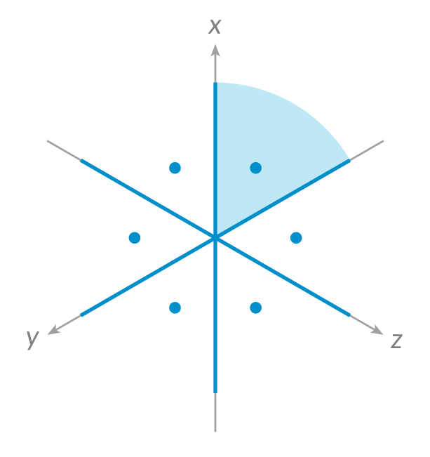
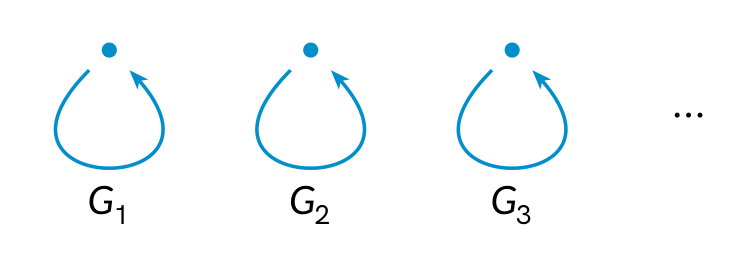
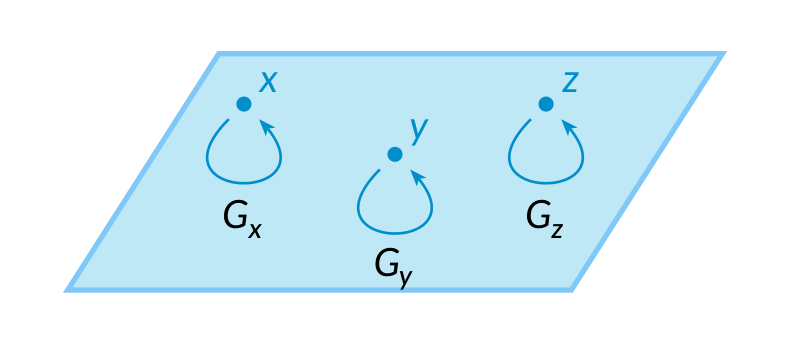
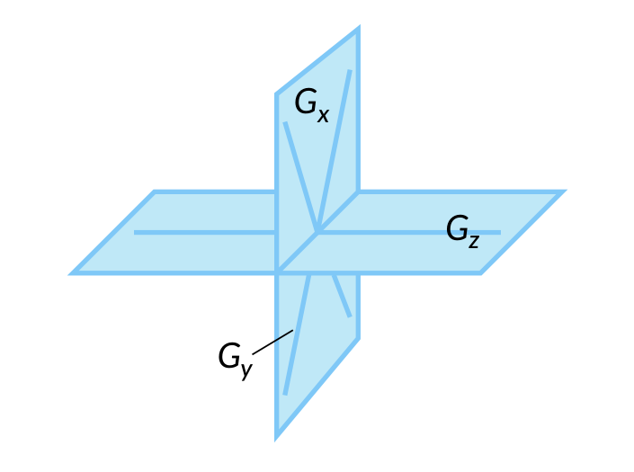

The main purpose of this article is to give a hopefully simple explanation of
the _component lattice_ defined in the paper
\[[Bu, Halpern-Leistner, Ibáñez Núñez, Kinjo](#references)\],
which makes it possible to generalize many useful notions in Lie theory,
including characters and cocharacters, root systems, and Weyl groups,
to the context of stacks.

Although the paper is written in a somewhat technical style,
the intuitive ideas behind it are not as difficult,
and this article is here to explain them.
Prerequisites of this article include basic category theory
and a good understanding of complex Lie groups.



## Recap of Lie theory

The part of Lie theory that is relevant to our story,
which is also one of my favourite parts of mathematics,
is the correspondence between complex Lie groups and
perfectly symmetric patterns in euclidean space,
the root systems.

For example, the group $\mathrm{GL}_3 (\mathbb{C})$
corresponds to the following root system in $\mathbb{R}^3$:





**Figure 1** The root system of $\mathrm{GL}_3 (\mathbb{C})$


Here, we project $\mathbb{R}^3$ onto the plane along the $(1, 1, 1)$-direction,
so the symmetry can be better seen from the picture.
There are $6$ roots indicated by blue dots,
with coordinates $(1, -1, 0)$ and all its $6$ permutations,
all lying on the plane $x + y + z = 0$.
The blue lines represent planes perpendicular to the root vectors,
given by $x = y$, $y = z$, and $x = z$.
The light blue area is given by the inequalities
$x \geq y \geq z$;
it is a **chamber** cut out by the planes,
and there are $6$ chambers in total.

In general, this construction roughly goes as follows.
Any complex Lie group $G$ admits a **maximal torus** $T \subset G$,
which is a subgroup of the form $T \simeq (\mathbb{C}^\times)^n$ for some $n$,
where $\mathbb{C}^\times = \mathbb{C} \setminus \\{ 0 \\}$
is the multiplicative group of non-zero complex numbers.
The number $n$ is the **rank** of $G$.
For example, the rank of $\mathrm{GL}_n (\mathbb{C})$ is $n$,
and its subgroup of diagonal matrices is a maximal torus.

Consider the **cocharacter lattice** and the **character lattice** of $T$,
$$
  \begin{aligned}
    \Lambda_T & = \mathrm{Hom} (\mathbb{C}^\times, T) \simeq \mathbb{Z}^n \ ,
    \\\\[1ex]
    \Lambda^T & = \mathrm{Hom} (T, \mathbb{C}^\times) \simeq \mathbb{Z}^n \ ,
  \end{aligned}
$$
which are dual to each other.
It is sometimes helpful to think of the real versions,
$\Lambda_T \otimes \mathbb{R} \simeq \mathbb{R}^n$ and
$\Lambda^T \otimes \mathbb{R} \simeq \mathbb{R}^n$.

The set of **roots** $\Phi \subset \Lambda_T$
is a finite set defined as follows.
The Lie algebra $\mathfrak{g}$ of $G$ is a representation of $T$
via the adjoint action,
and $\Phi \subset \Lambda^T$
is the set of non-zero weights of this representation.
Each root also determines a hyperplane in $\Lambda_T$,
and the set of these hyperplanes is the
**root hyperplane arrangement** in $\Lambda_T$,
represented by blue lines in [Figure 1](#fig-1).

The set of roots being 'perfectly symmetric',
or precisely, it being a **root system**
([Wikipedia](https://en.wikipedia.org/wiki/Root_system)),
is one of the characterizing properties of **reductive groups**
([Wikipedia](https://en.wikipedia.org/wiki/Reductive_group)),
which include $\mathrm{GL}_n (\mathbb{C})$.

The **Weyl group** $W$ is a finite group acting on $\Lambda_T$ and $\Lambda^T$,
defined as the quotient $\mathrm{N}_G (T) / \mathrm{Z}_G (T)$.
When $G$ is connected and reductive,
$W$ is precisely the group of reflections across the root hyperplanes.
For $\mathrm{GL}_n (\mathbb{C})$, as shown in [Figure 1](#fig-1),
the Weyl group is isomorphic to the symmetric group $\mathrm{S}_n$,
acting on $\Lambda_T$ by permuting the $n$ coordinates.

We are particularly interested in the quotient sets
$$
  \Lambda_T / W
  \quad \text{and} \quad
  \Lambda^T / W \ ,
$$
which can be thought of a single chamber in the root hyperplane arrangement,
or the light blue area in [Figure 1](#fig-1).
They occur frequently in representation theory,
although they are not usually phrased this way as quotients.
For example, when $G$ is reductive, we have the following:

- **Cohomology:** The cohomology of the classifying space $\mathrm{B} G$ is
  $$
    \mathrm{H}^\bullet (\mathrm{B} G; \mathbb{Q}) \simeq
    \mathbb{Q} [x_1, \dotsc, x_n]^W \ ,
  $$
  where $x_1, \dotsc, x_n$ is a set of coordinates on $\Lambda_T$,
  and the superscript $W$ means taking the invariant part
  under the Weyl group action.
  In other words, the cohomology is the space of
  $W$-invariant polynomial functions on $\Lambda_T$,
  or equivalently, polynomial functions on the quotient $\Lambda_T / W$.

- **Representations:** All finite-dimensional representations of $G$
  split into direct sums of irreducible representations,
  and the irreducible representations are in one-to-one correspondence
  with the quotient set $\Lambda^T / W$,
  where each representation corresponds to its highest weight.

- **Cocharacters:** Conjugacy classes of cocharacters of $G$,
  or homomorphisms $\mathbb{C}^\times \to G$,
  are in one-to-one correspondence with $\Lambda_T / W$.

## Stacks

Stacks are a very interesting type of geometric objects,
with many applications in algebraic and differential geometry, number theory, and physics.
Just as manifolds are essential to classical geometry,
stacks (and their friends) are essential to the quantum geometry of the real world that we live in.

For newcomers, stacks can be intimidating, especially given a 7,000-page textbook on the subject,
[_The Stacks project_](https://stacks.math.columbia.edu/).
However, the basic ideas are, again, not difficult to explain.

Recall that a **groupoid** is, by definition,
a category where all morphisms are invertible.
Here, we think of it slightly differently:
For us, a groupoid is a set where each element is equipped with a group,
called its **automorphism group**.





**Figure 2** A groupoid


It is clear how to interpret such a set with automorphism groups as a groupoid;
conversely, it is also easy to show that every (small) groupoid is equivalent to one obtained this way.

A **stack** can be roughly defined as a **Lie groupoid**,
that is, a groupoid whose sets of objects and morphisms
are complex manifolds.
In other words, a stack is like a complex manifold,
but each point is equipped with an automorphism group, which is a complex Lie group.





**Figure 3** A stack


For example, each complex manifold is itself a stack,
where each point has a trivial automorphism group.

As a slightly less trivial example, for a complex Lie group $G$,
there is the **classifying stack** denoted by $* / G$
(read as 'point mod $G$'),
which has a single point with automorphism group $G$.
In this way, Lie groups can be seen as special cases of stacks.


The precise definition of stacks is more complicated,
mostly because it is tricky to deal with equivalences of stacks:
Two stacks should be seen as the same if they are 'categorically equivalent'
in a suitable sense, even if their manifolds of objects and morphisms may not be isomorphic.
This makes it difficult to even define what a morphism of stacks is,
as we need to make such equivalences invertible.
Once this is properly dealt with, we will arrive at a correct definition.

Another point is that for many applications,
we need to work with singular spaces rather than manifolds,
or sometimes, varieties and schemes.
This also adds considerable complexity to the theory,
and leads to a zoo of Grothendieck topologies,
but we will not worry about this here.


Given a complex stack $X$, there is the **geometric realization** $|X|$,
which is a topological space, well-defined up to homotopy equivalence.
For example, for the classifying stack $* / G$,
its geometric realization is the classifying space $\mathrm{B} G$,
which is also the homotopy quotient of a point by $G$.

## The component lattice

As we explained, stacks can be seen as a generalization of Lie groups.
The component lattice of a stack is the corresponding generalization
of the combinatorial data $\Lambda_T / W$, which we also discussed above.

Intuitively, for a stack $X$, its **component lattice** $\mathrm{CL} (X)$
is defined by taking the automorphism group $G_x$ of each point $x \in X$,
then taking the data $\Lambda_T / W$ for each of these groups $G_x$,
then gluing them together in a suitable manner,
according to the topology of $X$.





**Figure 4** An example of the component lattice


In the picture, each plane is understood as divided by its own Weyl group, so that only one chamber in each plain remains.

What often happens is that only finitely many pieces $\Lambda_T / W$ are needed,
as all other pieces either fall within, or completely overlaps with one of the finitely many pieces,
such as in [Figure 4](#fig-4), the piece for $G_y$ lies completely within the piece for $G_x$.

The precise definition goes as follows.
For a complex stack $X$, define its **component lattice** $\mathrm{CL} (X)$
as the set of connected components
$$
  \mathrm{CL} (X) =
  \text{π}_0 \bigl( \\, \mathrm{Map} (* / \mathbb{C}^\times, X) \\, \bigr)
$$
of the space of maps from the classifying stack $* / \mathbb{C}^\times$ to $X$.

For example, when $X = * / G$ is a classifying stack,
the set of such maps $* / \mathbb{C}^\times \to * / G$
is the set of cocharacters $\mathbb{C}^\times \to G$ up to conjugation,
which can be identified with $\Lambda_T / W$. That is,
$$
  \mathrm{CL} (* / G) \simeq \Lambda_T / W \ .
$$

More generally, for a general stack $X$,
a map $* / G \to X$ is just a point $x \in X$
together with a cocharacter $\mathbb{C}^\times \to G_x$ up to conjugation,
and taking the set of connected components of the space of such maps
amounts to identifying two such maps whenever
one of them can be continuously deformed to the other.
This explains why $\mathrm{CL} (X)$ can be thought as
glued from the data $\Lambda_T / W$ at its points.

## Applications

### Weyl groups

The component lattice allows us to generalize the notion of Weyl groups to stacks.
In \[[Bu, Halpern-Leistner, Ibáñez Núñez, Kinjo](#references)\],
we construct a **category of special faces** of a stack $X$,
which is often a finite category,
where automorphism groups of objects behave like Weyl groups.

For example, when $X$ is a classifying stack $* / G$,
objects of the category of special faces are Levi subgroups $L \subset G$,
and the automorphism group of $L$ in this category
is the relative Weyl group
$W_L = \mathrm{N}_G (\mathrm{Z} (L)) / \mathrm{Z}_G (\mathrm{Z} (L))$,
which gives the Weyl group of $G$ when $L$ is minimal.

### Root systems

We have not touched on generalizing roots to stacks yet,
but they are explained in
\[[Bu, Halpern-Leistner, Ibáñez Núñez, Kinjo](#references): §5.3\],
where roots are generalized to **cotangent weights**.

### And more

Many results about $\Lambda_T / W$ and $\Lambda^T / W$
can also be generalized to stacks,
including all those listed at the end of [§1](#recap-of-lie-theory).
Namely, the result about cocharacters is already taken as the definition of the component lattice,
and the ones about cohomology and representations are studied in
\[[Bu, Davison, Ibáñez Núñez, Kinjo, Pădurariu](#references)\]
and
\[[Bu, Pădurariu, Toda](#references)\],
respectively.
I am sure more results like these will be discovered in the future.

## References

- **Bu**, C., **Davison**, B., **Ibáñez Núñez**, A., **Kinjo**, T., and **Pădurariu**, T.
  Cohomology of symmetric stacks.\
  
  Preprint.
  \
  ([arXiv](https://arxiv.org/abs/2502.04253))

- **Bu**, C., **Halpern-Leistner**, D., **Ibáñez Núñez**, A., and **Kinjo**, T.
  Intrinsic Donaldson--Thomas theory. I. Component lattices of stacks.\
  
  Preprint.
  \
  ([arXiv](https://arxiv.org/abs/2502.13892))

- **Bu**, C., **Pădurariu**, T., and **Toda**, Y.
  Semiorthogonal decompositions for stacks.\
  
  Work in progress.
  

